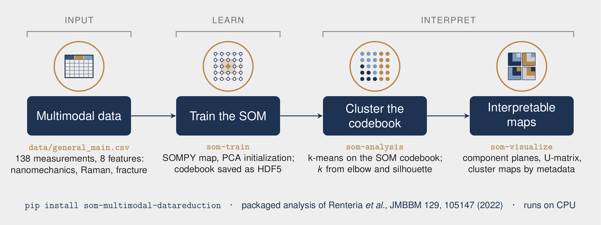

# som-multimodal-datareduction

Self-organizing maps (SOMs) and k-means for multimodal materials data: high-dimensional, mixed-source measurements reduced to maps that can be read and compared.

[](https://github.com/crentb/som-multimodal-datareduction/actions/workflows/ci.yml)
[](https://pypi.org/project/som-multimodal-datareduction/)
[](pyproject.toml)
[](https://doi.org/10.5281/zenodo.21148597)
[](LICENSE)



A reproducible command-line pipeline, and the packaged version of the analysis behind the paper below, in which nanomechanical, Raman, and fracture measurements of tooth enamel are fused to map structure-property relationships with aging across species. Vector schematic: [docs/som_pipeline.pdf](docs/som_pipeline.pdf).

**Associated publication (dataset and method):** C. Renteria, W. Yan, Y. L. Huang, D. D. Arola, "Contributions to enamel durability with aging: An application of data science tools," *Journal of the Mechanical Behavior of Biomedical Materials* 129, 105147 (2022), [doi:10.1016/j.jmbbm.2022.105147](https://doi.org/10.1016/j.jmbbm.2022.105147).

## Data

The shipped dataset, `data/general_main.csv` (138 measurements), carries eight features: modulus, hardness, carbonate, crystallinity, fluorescence, depth, fracture toughness (`kc`), and a crack-resistance parameter (`b`), plus tooth, mammal, and position metadata.

## Outputs

| Figure | Description |
|--------|-------------|
| `component_planes.png` | One heat map per feature over the trained SOM grid, with k-means cluster borders overlaid; shows how each property varies and which properties co-vary. |
| `cluster_map_by_<label>.png` | SOM nodes colored by k-means cluster, with data points colored by a metadata column (for example `mammal`); shows how groups distribute across the map. |
| `umatrix.png` | Unified distance matrix (inter-node distances) with projected samples; reveals cluster boundaries. |
| `cluster_diagnostics.png` | Elbow and silhouette scores against *k*, for choosing the cluster count. |

## Installation

From PyPI:

```bash
pip install som-multimodal-datareduction
```

As a signed container image:

```bash
docker pull ghcr.io/crentb/som-multimodal-datareduction:v0.2.0
```

From source, for development (the bundled dataset lives in the repository):

```bash
git clone https://github.com/crentb/som-multimodal-datareduction.git
cd som-multimodal-datareduction
pip install -e ".[dev]"      # core + pytest, ruff, black, mypy, pre-commit
```

No GPU or deep-learning stack is required, only the standard scientific Python libraries. The SOM core (SOMPY) is vendored, so nothing extra is fetched at install.

## Quick start

End to end (train, then figures) on the bundled data:

```bash
som-pipeline --data-csv data/general_main.csv --n-clusters 6 --output-dir outputs
```

Or step by step:

```bash
som-train     --data-csv data/general_main.csv --mapsize 25 25 --output-dir outputs
som-analysis  --output-dir outputs --k-min 2 --k-max 12      # choose k (elbow, silhouette)
som-visualize --output-dir outputs --n-clusters 6 --label-column mammal
```

Every entry point shares the same flags (`--features`, `--mapsize`, `--normalization`, `--n-clusters`, `--label-column`, ...); run any with `-h` for the full list. Use `--features` to point the same pipeline at a different column set or dataset.

## How it works

```text
CSV --> train --> som_codebook.h5 --> visualize --> PNG figures
        (SOMPY build + train,          (rebuild SOM, k-means
         topographic and quantization   over the codebook, render)
         error, save codebook)
```

- **`config.RunConfig`**: one dataclass holding every parameter, shared by all command-line tools.
- **`train.py`**: builds a SOMPY map (`var` normalization, PCA initialization), trains it, reports topographic and quantization error, and writes the codebook and data to HDF5.
- **`io.py`**: the HDF5 schema (codebook, data, map size, feature names, specimen IDs), interchangeable with the original notebooks.
- **`visualize.py`**: reloads the codebook, clusters it with k-means, and renders the figures through the engine.
- **`analysis.py`**: elbow and silhouette diagnostics for choosing *k*.

## Repository layout

```text
som_multimodal/
  config.py  train.py  visualize.py  analysis.py  pipeline.py  io.py
  engine/          modified tfprop_sompy visualization layer (credited)
  _vendor/sompy/   vendored SOMPY core (Apache-2.0, verbatim)
data/              general_main.csv and its data dictionary
docs/              overview figure (PNG, PDF, LaTeX source), performance profile, flame graph
scripts/           profiling utility
tests/             fast, synthetic, CPU tests
```

## Testing and continuous integration

```bash
pytest -m "not slow"    # fast, synthetic, CPU-only suite (what CI runs)
pytest                  # everything
```

Every push and pull request runs one gate, defined in [ci.yml](.github/workflows/ci.yml). Lint, format, and type checks cover the original pipeline and tests; the vendored SOMPY and the modified engine are excluded.

- **Quality:** ruff, black, mypy (advisory), and pytest with coverage on Python 3.10 to 3.14.
- **Security (blocking):** gitleaks secret detection over the full history, bandit static analysis at medium severity and above, and pip-audit against known vulnerabilities.
- **Container:** image build, a trivy scan that blocks on fixable critical and high findings, the test suite run inside the image, and an SPDX software bill of materials signed keylessly with cosign.

The same gate re-runs weekly on `main` ([scheduled-scan.yml](.github/workflows/scheduled-scan.yml)), so a newly published vulnerability surfaces without a code change. A version tag re-runs it on the tagged commit before [release.yml](.github/workflows/release.yml) publishes to PyPI through Trusted Publishing (no stored tokens) and pushes a scanned, cosign-signed image with SLSA build provenance to the GitHub Container Registry. To verify a published image:

```bash
cosign verify ghcr.io/crentb/som-multimodal-datareduction:v0.2.0 \
  --certificate-identity-regexp 'github.com/crentb/' \
  --certificate-oidc-issuer https://token.actions.githubusercontent.com
gh attestation verify oci://ghcr.io/crentb/som-multimodal-datareduction:v0.2.0 --owner crentb
```

To report a vulnerability, see [SECURITY.md](SECURITY.md).

## Attribution

This project **builds on, and contains modified copies of, prior open-source work**. Only the overall pipeline, the HDF5 schema, the command-line tools, the enamel feature set, and the dataset are original here.

- **SOMPY**: Vahid Moosavi (@sevamoo) et al., Apache-2.0. The SOM core, vendored.
- **tfprop_sompy**: Gota Kikugawa and Yuta Nishimura (Tohoku University). The visualization layer, used here in **modified** form.
- Notebook and template lineage: Tim Letz (UW SOM lab) and the Huang group (UW) MSESOM.

Full details and per-file modification notes: [NOTICE](NOTICE) and [som_multimodal/engine/ACKNOWLEDGMENTS.md](som_multimodal/engine/ACKNOWLEDGMENTS.md).

## Citation

Please cite the **JMBBM 2022 paper** above (the dataset and method) and this software. GitHub's "Cite this repository" button reads [CITATION.cff](CITATION.cff).

```bibtex
@software{renteria_som_multimodal_datareduction,
  author    = {Renteria, Cameron B.},
  title     = {som-multimodal-datareduction},
  version   = {0.2.0},
  year      = {2026},
  publisher = {Zenodo},
  doi       = {10.5281/zenodo.21148597},
  url       = {https://github.com/crentb/som-multimodal-datareduction}
}
```

## License

[Apache-2.0](LICENSE). Vendored and modified upstream code is redistributed under its original Apache-2.0 terms, with attribution preserved.
